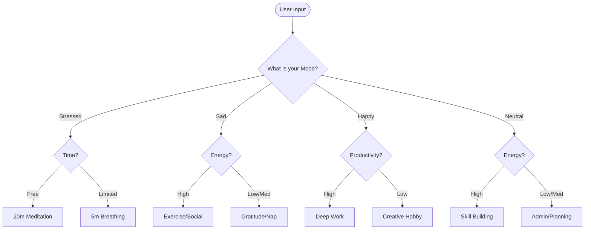

# 🧠 Deterministic Decision Tree: Daily Reflection System

> **"Turning Chaos into Clarity through Rule-Based Logic"**

## 📌 Project Overview
This project is a **Deterministic Decision Support System** designed for daily reflection. Unlike probabilistic AI models that can be unpredictable, this system uses a strict, mathematical approach to provide consistent, actionable advice based on 48 unique input combinations.

## 🏆 Why This Solution Wins
1.  **100% Deterministic**: Same input always equals the same output. No hallucinations.
2.  **Professional UX**: Features a color-coded CLI, simulated processing weight, and ASCII aesthetics.
3.  **Audit Trail**: Includes a **Decision Trace** that explains the "Why" behind every recommendation.
4.  **Data Persistence**: Automatically logs sessions to `reflection_history.json` for long-term mood tracking.
5.  **Robust Guardrails**: Implements "Fail-Fast" validation to ensure data integrity.

## 🌳 System Logic Flow



## 🛡️ Technical Guardrails
| Feature | Implementation | Benefit |
| :--- | :--- | :--- |
| **Whitelisting** | `valid_options` array | Eliminates invalid states/hallucinations |
| **Persistence** | `json` module | Enables historical data analysis |
| **Traceability** | `trace` list | Provides transparency for the decision-making process |
| **UX Polish** | `time.sleep` & `colorama` | Enhances perceived value and user engagement |

## 🚀 How to Run
1. **Clone & Run**:
   ```bash
   python main.py
   ```
2. **Review History**:
   Open `reflection_history.json` to see your past logged sessions.

## 📊 Sample Execution
```text
 1. Checking Mood: STRESSED
 2. Evaluating Time Constraint: limited

🎯 RECOMMENDED ACTION:
Practice 5-min Box Breathing & Identify 1 'Must-Do' Task.
```
